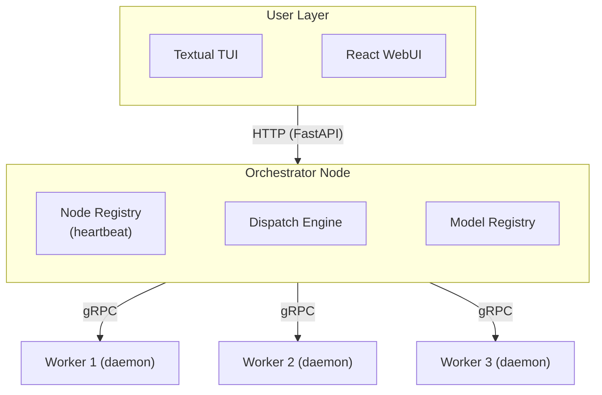

# PiSSM

Distributed inference for State Space Models on a Raspberry Pi 5 cluster.

PiSSM runs Mamba, S4, and small LLM inference across a cluster of Raspberry Pi 5 units. The user provides a model checkpoint and a YAML manifest. The system handles node discovery, model sharding, pipeline execution, and fault recovery transparently.

## Hardware

6x Raspberry Pi 5B, 4 GB RAM, 20 GB SD storage, connected over Gigabit Ethernet. Total cluster memory: 24 GB.

## Architecture



Each Pi runs a background daemon that broadcasts presence and hardware state. The orchestrator maintains a live node registry and handles dispatch. Model layers are split into contiguous shards assigned to worker nodes. Activations pass node-to-node through the pipeline over gRPC.

## Supported Architectures

- **Mamba** -- selective state space models (primary target)
- **S4** -- structured state space sequences (primary target)
- **Transformer LLMs** -- TinyLlama, Phi-2 (secondary, memory-dependent)

## Model Manifest

```yaml
name: mamba-370m
arch: mamba              # mamba | s4 | llm-transformer
checkpoint: model.pt
layers: 48
hidden_dim: 1024
state_dim: 16
input_type: text         # text | timeseries | audio
tokenizer: tokenizer.json
```

## Interfaces

**TUI** -- built with Textual. Commands: `listn`, `compile <manifest>`, `run <model> "<input>"`, `status`, `logs`, `vim topology.yaml`.

**WebUI** -- React frontend served by the orchestrator at `http://<orchestrator-ip>:8080`. Provides a node dashboard, model registry, inference panel, and topology visualizer.

## Stack

| Component | Technology |
|-----------|------------|
| Inference | PyTorch |
| Inter-node | gRPC + Protocol Buffers |
| Orchestrator API | FastAPI |
| TUI | Textual |
| WebUI | React |
| Config | YAML |

## Getting Started

### Prerequisites

- Python 3.11 or later
- pip

### Setup

```bash
git clone https://github.com/syedtaha22/PiSSM.git
cd PiSSM

python3 -m venv .venv
source .venv/bin/activate

# For development (includes pytest, black, ruff)
pip install -e ".[dev]"

# For running only (no dev tools)
pip install .
```

### Generate gRPC Stubs

After cloning or any time a `.proto` file changes:

```bash
make proto
```

### Run Tests

```bash
make test
```

### Format and Lint

```bash
make lint     # check with ruff + black
make format   # auto-format with black
```

## Status

Active development. See `docs/SRS.md` for full system specification and `docs/Summer_Sprint.md` for current sprint scope.

## Repo Structure (Tentative)

```
piSSM/
├── orchestrator/       # orchestrator process, dispatch engine, node registry
├── worker/             # inference daemon, model loaders, shard execution
├── interfaces/
│   ├── tui/            # Textual TUI
│   └── webui/          # React frontend
├── proto/              # .proto definitions for gRPC services
├── models/             # manifest examples and loader implementations
├── benchmarks/         # benchmark runner and result CSVs
└── docs/               # SRS, Proposal, Sprint Plan
```
