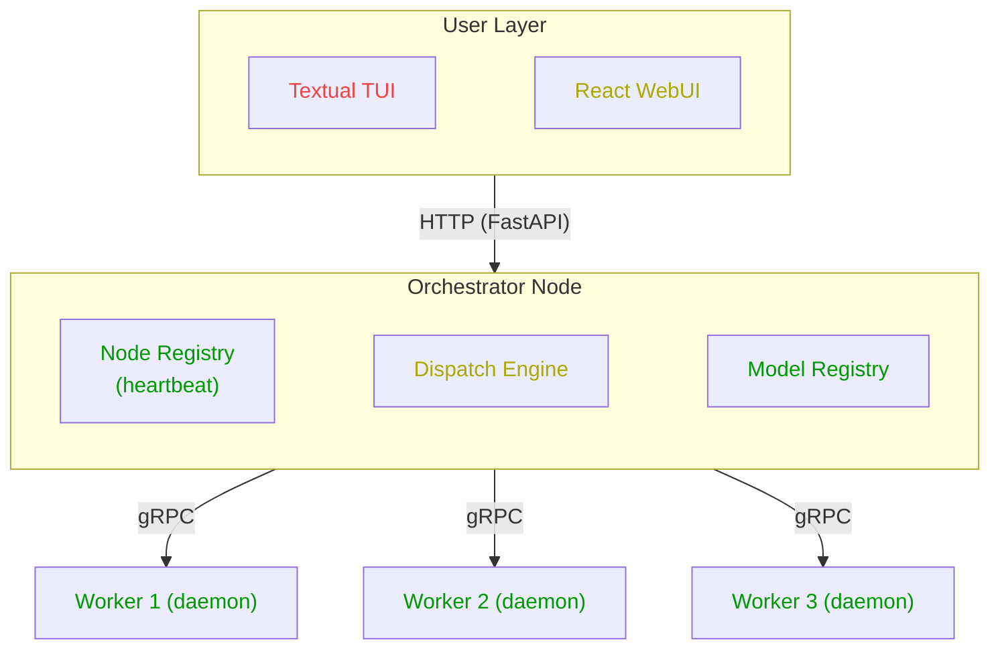

# PiSSM

Distributed inference for State Space Models on a Raspberry Pi 5 cluster.

PiSSM runs Mamba, S4, and small LLM inference across a cluster of Raspberry Pi 5 units. The user provides a model checkpoint and a YAML manifest. The system handles node discovery, model sharding, and pipeline execution transparently.

## Hardware

6x Raspberry Pi 5B, 4 GB RAM, 20 GB SD storage, connected over Gigabit Ethernet. Total cluster memory: 24 GB.

## Architecture


```mermaid
flowchart TB
    classDef complete color:#009900;
    classDef inprogress color:#aaaa00;
    classDef todo color:#ee4444;


    subgraph UserLayer["User Layer"]
        TUI["Textual TUI"]:::todo ~~~ WEB["React WebUI"]:::inprogress
    end

    UserLayer --> |"HTTP (FastAPI)"| ORCH

    subgraph ORCH["Orchestrator Node"]
        REG["Node Registry<br/>(heartbeat)"]:::complete ~~~ DISP["Dispatch Engine"]:::inprogress ~~~ MODEL["Model Registry"]:::complete
    end

    ORCH -->|"gRPC"| W1
    ORCH -->|"gRPC"| W2
    ORCH -->|"gRPC"| W3

    W1["Worker 1 (daemon)"]:::complete
    W2["Worker 2 (daemon)"]:::complete
    W3["Worker 3 (daemon)"]:::complete
```

Each Pi runs a background daemon that broadcasts presence and hardware state. The orchestrator maintains a live node registry and handles dispatch. Model layers are split into contiguous shards assigned to worker nodes. Activations pass node-to-node through the pipeline over gRPC.

(Green: Complete, Yellow: In Progress, Red: Todo)

## Supported Architectures

- **Mamba** -- selective state space models (primary target)
- **S4** -- structured state space sequences (primary target)
- **Transformer LLMs** -- TinyLlama, Phi-2 (secondary, memory-dependent)

## Getting Started

### Prerequisites

- Python 3.11 or later
- Node.js 18 or later and npm (needed once, to build the WebUI)

### Install

```bash
git clone https://github.com/syedtaha22/PiSSM.git
cd PiSSM

python3 -m venv .venv
source .venv/bin/activate

pip install .
```

**On Raspberry Pi (aarch64):** `pip install .` may fail with a "No space left on device" or similar error. If it does, install CPU-only torch first:

```bash
pip install torch --extra-index-url https://download.pytorch.org/whl/cpu
pip install .
```

If it still fails, open an issue.

### Run

On the machine that will act as the orchestrator:

```bash
make run-orchestrator
```

This builds the WebUI on first run and starts the orchestrator, listening on port 50051 (gRPC, for workers) and port 8080 (HTTP, for the WebUI).

On each worker node (a Raspberry Pi in the cluster, or another terminal on the same machine to try it locally):

```bash
python3 -m worker.daemon --orchestrator <orchestrator-ip>:50051 --node-id <node-name>
```

A node's IP address is auto-detected, preferring a wired connection over Wi-Fi. If a node has both active and it still picks the wrong one, pin it explicitly with `--ip <address>`.

Then open `http://<orchestrator-ip>:8080` in a browser. Any manifest already in `manifests/` is registered automatically at startup -- pick one on the Inference page to load it onto the connected workers and start sending prompts.

### Model Manifest

To use your own model, add a YAML file like this to `manifests/`:

```yaml
name: mamba-370m
arch: mamba              # mamba | s4 | llm-transformer
checkpoint: model.pt
layers: 48
hidden_dim: 1024
state_dim: 16
input_type: text         # text | timeseries | audio
tokenizer: tokenizer.json
```

## Status

Active development. See `docs/SRS.md` for full system specification and `docs/Summer_Sprint.md` for current sprint scope.

---

## Development

The sections below are for working on PiSSM itself, not for running it.

### Stack

| Component | Technology |
|-----------|------------|
| Inference | PyTorch |
| Inter-node | gRPC + Protocol Buffers |
| Orchestrator API | FastAPI |
| WebUI | React (Next.js) |
| Config | YAML |

### Dev Setup

```bash
# Add dev tools (pytest, black, ruff) on top of the regular install
pip install -e ".[dev]"
```

### Generate gRPC Stubs

After cloning or any time a `.proto` file changes:

```bash
make proto
```

### Run Tests

```bash
make test        # fast unit tests
make test-slow   # tests that load a real model (slow, RAM-heavy)
```

### Format and Lint

```bash
make lint     # check with ruff + black
make format   # auto-format with black
```

### Versioning

`pyproject.toml`'s `version` follows semver, bumped by hand:

- **Major (x.0.0):** a complete new subsystem or user-facing layer - a new technology stack, new interface, or fundamentally new capability. Dashboard, TUI, a new protocol layer.
- **Minor (0.x.0):** meaningful additions within an existing subsystem - new endpoints, new model support, new benchmark scripts, significant feature expansion.
- **Patch (0.0.x):** bug fixes, dependency updates, docs, config, small improvements.

### WebUI Dev Commands

```bash
make webui-install   # npm install
make webui-dev       # npm run dev (hot reload, separate from the orchestrator)
make webui-build     # npm run build (regenerate dashboard/out/ after frontend changes)
```

### Repo Structure

```
piSSM/
├── orchestrator/       # orchestrator process, dispatch engine, node/model registries, HTTP API
├── worker/             # inference daemon, heartbeat client
├── inference/          # model loaders, manifest parsing, shard modules
├── dashboard/          # React (Next.js) WebUI
├── proto/              # .proto definitions for gRPC services
├── manifests/          # model manifest examples, auto-registered at orchestrator startup
├── scripts/            # pipeline runner, profiling, benchmarks, dummy-model generator
├── benchmarks/         # benchmark result CSVs
├── notebooks/          # comparison notebooks (pipeline vs single-node, optimization runs)
├── tests/              # unit and integration tests
└── docs/               # SRS, Proposal, Sprint Plan, test catalog
```
