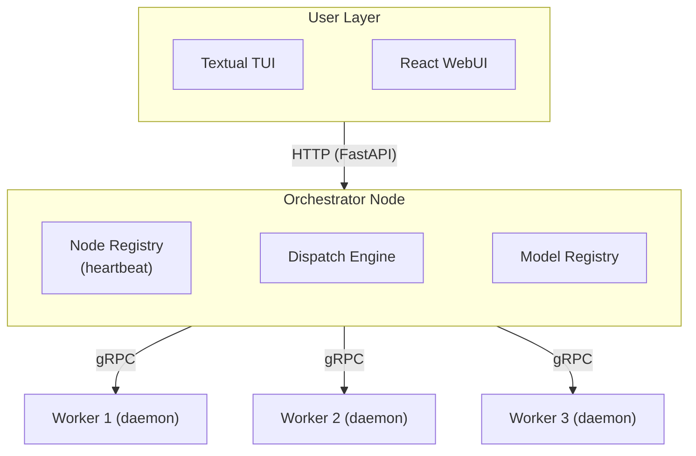

# Software Requirements Specification
## Distributed SSM Inference System on Raspberry Pi Cluster

**Version:** 0.1  
**Status:** Draft  

---

## 1. Introduction

### 1.1 Purpose

This document specifies the requirements for a distributed inference system that runs State Space Models (SSMs) and compatible architectures across a cluster of Raspberry Pi 5 nodes. The system handles model sharding, node orchestration, fault tolerance, and user interaction through both a terminal UI and a web interface.

### 1.2 Scope

The system, referred to hereafter as **PiSSM**, enables a user to submit a trained model checkpoint and a manifest file, and have inference executed across the cluster transparently. The user is never required to write code or understand the sharding decisions. The system targets SSM architectures (S4, Mamba) as primary targets and smaller transformer-based LLMs as a secondary target where cluster memory permits.

PiSSM does not handle model training. It is purely an inference platform.

### 1.3 Definitions

| Term | Meaning |
|------|---------|
| Node | A single Raspberry Pi 5 unit in the cluster |
| Orchestrator | The node (or process) responsible for dispatch, topology management, and routing |
| Worker | Any node running the inference daemon and accepting work assignments |
| Manifest | A user-provided YAML file describing a model's architecture and checkpoint location |
| Shard | A contiguous group of model layers assigned to a single worker node |
| Pipeline parallel | Execution where each node processes a different layer group sequentially |
| Topology | The current assignment of model shards to worker nodes |

### 1.4 Constraints

- Hardware: 6x Raspberry Pi 5B, 4 GB RAM each, 20 GB SD storage each
- Network: Gigabit Ethernet (~125 MB/s inter-node bandwidth)
- Inference only: no training, no gradient computation
- User-facing interfaces: Textual TUI and React WebUI
- Backend language: Python
- Inter-node communication: gRPC with Protocol Buffers

---

## 2. System Overview

### 2.1 Architecture

PiSSM follows a coordinator-worker architecture. One node is designated the orchestrator at startup (or elected if the primary fails). All other nodes run the worker daemon. The orchestrator exposes a FastAPI HTTP server consumed by both the TUI and WebUI. Workers expose gRPC endpoints consumed by the orchestrator.





### 2.2 Model Support

PiSSM supports models conforming to the following architectures:

- **Mamba** (primary): SSM with selective state spaces, based on the Gu & Dao 2023 formulation
- **S4** (primary): Linear State Space Layers as described in Gu et al. 2021
- **Transformer LLMs** (secondary): small models such as TinyLlama (1.1B) and Phi-2 (2.7B), subject to cluster memory availability

Support for a new architecture requires implementing one loader class internally. This is transparent to the user.

### 2.3 Model Manifest

Users describe their model using a YAML manifest. The system reads this file to select the correct loader and dispatch strategy.

```yaml
name: mamba-370m
arch: mamba              # mamba | s4 | llm-transformer
checkpoint: model.pt
layers: 48
hidden_dim: 1024
state_dim: 16
input_type: text         # text | timeseries | audio
tokenizer: tokenizer.json  # required if input_type is text
```

The user provides the manifest and checkpoint. The system handles everything else.

---

## 3. Functional Requirements

### 3.1 Node Management

- **FR-NM-01:** Each worker node shall broadcast a heartbeat to the orchestrator at a configurable interval (default: 2 seconds).

- **FR-NM-02:** The orchestrator shall maintain a live node registry tracking each node's identity, available RAM, and last heartbeat timestamp.

- **FR-NM-03:** A node that misses three consecutive heartbeats shall be marked as unavailable and excluded from dispatch decisions.

- **FR-NM-04:** The orchestrator shall support listing all nodes with their current status via the TUI command `listn` and the WebUI dashboard.

- **FR-NM-05:** Nodes shall automatically rejoin the cluster upon restart without manual intervention.

### 3.2 Model Registry

- **FR-MR-01:** The system shall maintain a registry of submitted models, storing the manifest, checkpoint path, and compilation status.

- **FR-MR-02:** A user shall be able to submit a model via `compile <manifest.yaml>` (TUI) or the WebUI upload form.

- **FR-MR-03:** The system shall validate the manifest on submission, reporting clear errors for missing fields or unsupported architecture values.

- **FR-MR-04:** A user shall be able to list registered models via `ls models` (TUI) or the WebUI model list.

- **FR-MR-05:** A user shall be able to delete a registered model.

### 3.3 Dispatch Engine

- **FR-DE-01:** On receiving a run request, the orchestrator shall query available RAM across all live nodes.

- **FR-DE-02:** The dispatch engine shall apply the following rules in order:

  - **Rule 1 (Single node):** If `model_size_fp16 < 0.6 × min_available_ram`, assign to the least-loaded node. No sharding.
  - **Rule 2 (Layer parallel, K nodes):** If the model fits across K nodes (K $\leq$ total live nodes), split layers into K contiguous groups. Assign one group per node. Execute as a pipeline: node i receives activations from node i-1.
  - **Rule 3 (Quantized fallback):** If the model does not fit in fp16 but fits in int8, prompt the user to confirm quantized inference and reapply Rules 1-2 with halved size estimate.
  - **Rule 4 (Rejection):** If no valid dispatch exists, return a clear error stating required versus available cluster memory.

- **FR-DE-03:** The dispatch decision and resulting topology shall be recorded and viewable by the user.

- **FR-DE-04:** The topology shall be inspectable and manually overridable via `vim topology.yaml` (TUI) or the topology editor (WebUI).

### 3.4 Inference Execution

- **FR-IE-01:** The system shall accept user input appropriate to the model's `input_type` (text prompt, numeric array, or audio file path).

- **FR-IE-02:** For text input, the system shall run the associated tokenizer before passing data to the first worker shard.

- **FR-IE-03:** For timeseries or audio input, the system shall normalize and chunk the input to the model's configured sequence length.

- **FR-IE-04:** Pipeline execution shall pass activations between worker nodes via gRPC. Each node processes its assigned shard and forwards output to the next.

- **FR-IE-05:** The final node shall return the output to the orchestrator, which returns it to the user interface.

- **FR-IE-06:** Inference latency (end-to-end) and per-node execution time shall be recorded for every request.

### 3.5 Fault Tolerance

- **FR-FT-01:** If a worker node becomes unavailable during an active inference request, the orchestrator shall detect the failure and abort the current request with an informative error.

- **FR-FT-02:** The orchestrator shall immediately attempt to re-dispatch the same request to remaining live nodes using the dispatch rules. If no valid dispatch exists, the error is surfaced to the user.

- **FR-FT-03:** The node registry shall be updated immediately upon failure detection. Subsequent requests will not be dispatched to the failed node.

- **FR-FT-04:** Recovery of a failed node shall be automatic upon reconnection.

### 3.6 TUI (Textual)

- **FR-TUI-01:** The TUI shall launch as a standalone terminal application and connect to the orchestrator's HTTP API.

- **FR-TUI-02:** The TUI shall support the following commands:

    | Command | Description |
    |---------|-------------|
    | `listn` | List all nodes with status and available RAM |
    | `ls models` | List registered models |
    | `compile <manifest.yaml>` | Submit a model manifest |
    | `run <model_name> "<input>"` | Run inference on a registered model |
    | `vim topology.yaml` | Open topology file in editor |
    | `status` | Show cluster summary |
    | `logs [node_id]` | Tail inference logs |

- **FR-TUI-03:** The TUI shall display a persistent status bar showing live node count and cluster RAM utilization.

- **FR-TUI-04:** The TUI shall display inference output and timing results inline after a `run` command completes.

### 3.7 WebUI

- **FR-WUI-01:** The WebUI shall be served by the orchestrator and accessible at `http://<orchestrator-ip>:8080` from any device on the local network.

- **FR-WUI-02:** The WebUI shall provide a dashboard showing node status, cluster RAM, and recent inference history.

- **FR-WUI-03:** The WebUI shall allow model submission via a file upload form accepting a manifest YAML and checkpoint file.

- **FR-WUI-04:** The WebUI shall provide an inference panel where the user selects a registered model, enters input, and views output.

- **FR-WUI-05:** The WebUI shall display the active topology visually, showing which model shards are assigned to which nodes.

- **FR-WUI-06:** The WebUI shall display per-request benchmark data (latency, throughput, memory usage per node).

### 3.8 Benchmarking

- **FR-BM-01:** The system shall record for every inference request: total latency, per-node execution time, activation transfer time between nodes, and peak memory usage per node.

- **FR-BM-02:** The system shall expose a benchmark mode where the same input is run N times and aggregate statistics (mean, p50, p95, p99 latency) are reported.

- **FR-BM-03:** Benchmark results shall be exportable as CSV.

---

## 4. Non-Functional Requirements

- **NFR-01 (Performance):** End-to-end inference latency for Mamba-130M on a single node shall be under 5 seconds for a 512-token input at steady state.

- **NFR-02 (Reliability):** The system shall handle single-node failure without crashing the orchestrator or other workers.

- **NFR-03 (Portability):** All software shall run on Raspberry Pi OS (64-bit, Debian Bookworm base) without modification.

- **NFR-04 (Usability):** A user unfamiliar with the system shall be able to submit and run a model within 10 minutes using the WebUI, given a valid manifest and checkpoint.

- **NFR-05 (Observability):** All inter-node gRPC calls shall be logged with timestamps. Logs shall be accessible from both the TUI and WebUI.

---

## 5. System Interfaces

### 5.1 User Interfaces

- Textual TUI: terminal-based, connects to orchestrator via HTTP
- React WebUI: browser-based, served by orchestrator FastAPI at port 8080

### 5.2 Inter-node Interface

gRPC with Protocol Buffers. Core service definitions:

- `NodeService`: heartbeat, status reporting
- `InferenceService`: load shard, run forward pass, return activations
- `RegistryService`: model registration, topology queries

### 5.3 External Interfaces

- PyTorch: model loading and forward pass execution
- Hugging Face tokenizers: text tokenization (where applicable)

---

## 6. Phased Delivery

### Phase 1: Cluster Foundation and Mamba Inference
Node daemon, heartbeat registry, gRPC skeleton, Mamba-130M inference on a single node, basic TUI shell.

### Phase 2: Distributed Inference and Interfaces
Layer-parallel sharding across multiple nodes, dispatch engine (Rules 1-4), Textual TUI feature-complete, WebUI dashboard and inference panel.

### Phase 3: Fault Tolerance and S4 Support
Node failure detection and re-dispatch, S4 loader, topology editor, benchmark mode.

### Phase 4: LLM Support, Quantization, and Research
TinyLlama/Phi-2 inference (subject to memory), int8 quantization, dynamic dispatch research prototype, benchmark suite for paper, paper writing.

---

## 7. Out of Scope

- Model training of any kind
- Custom kernel implementation (potential Semester 2 research extension)
- Multi-cluster or WAN deployment
- Model fine-tuning or weight modification
- Authentication or access control (single-user local network assumed)
